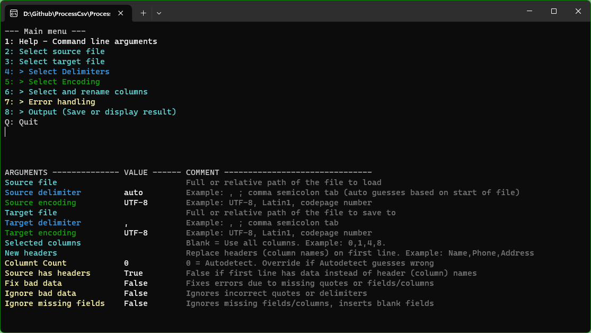

# ProcessCsv
#### Processes a CSV file to remove unwanted fields, change delimiter, encoding or inspect contents

by Andreas Aakvik Gogstad, 2023, https://github.com/snjo/processcsv

Uses CsvHelper by Josh Close, https://joshclose.github.io/CsvHelper/

ProcessCsv can be used either by running it with command line parameters, or if no parameters are used, through a menu based system.

## Command line parameter mode

### Command line arguments

    Processes a CSV file to remove unwanted columns, change delimiter, encoding or inspect contents

    PROCESSCSV /l file [/s file] [/cs columns] [/ie encoding] [/oe encoding]
        [/id delimiter] [/od delimiter] [/ex [number]] [/hd] [/q] [/p]
    
    PROCESSCSV sourcefile targetfile [other arguments]
    PROCESSCSV [No arguments] : Starts the program in menu based mode
    
    ARGUMENT        ALIAS      FUNCTION
    
    /help           /?         Displays this help page
    
    /load           /l         File name to load from (Source)
    /save           /s         File name to save to (Target)
                               Example: /l a.csv /s b.csv
    
    /inencoding     /ie        Encoding or codepage of the source file
                               Skip to autodetect (Program counts , ; and TAB)
    /outencoding    /oe        Encoding or codepage of the target file
                               Example encodings: UTF-8, UTF-8-BOM, LATIN1, ASCII, 865
                               Example: /ie Latin1 /oe UTF8
    
    /columnselect   /cs        Select columns in the CSV to keep in the target file.
                               If unspecified, all columns will be output.
                               Columns set to -1 will be empty.
                               Example: /cs 0,-1,-1,21,8
    
    /columncount    /cc        Manually specify the number of columns (fields) in the file.
                               Missing columns (fields) on a line will be added as empty values.
                               If not used, column count is guessed by the number of delimiters found on line 0 and 1
                               Example: /cc 4
    
    /example        /ex        Lists a number of lines from the start of the file. (Default is 5 lines)
                               Example: /ex 10
    
    /indelimiter    /id        The delimiter type used in the source file.
    /outdelimiter   /od        The delimiter type used for the target file.
                               Tab, comma and semicolon can be referenced by name.
                               Example: /id ; /od ,
                               Example: /id tab /od comma
    
    /showheaders    /hd        Lists all headers (column names) on the first line of the source file.
                               Use this to find the column numbers to use for the columnselect argument.
    
    /quiet          /q         No text output (except for Help, headers and example lines). Use exit codes to verify result.
    /pause          /p         Wait for keypress before exiting
    
    /ignorebaddata  /ibd       Proceed despite bad data, such as quotes that are not closed out or missing fields
    /ignoremissing  /imf       Proceed despite missing fields. Missing fields on a line will be added as empty values
    
    /fixbaddata     /fbd       Fix lines with bad data. Guesses based on number of delimiter characters present.
                               If delimiter count is wrong, columns may be misaligned. Also removes quotes from the fields.
    
    /newheaders     /nwh       Replace or add headers (column names) with a custom set of names.
                               Enclose text in quotes if names contain spaces.
                               If no names are listed, generic names are used.
                               Example: /nwh Name,Email,Phone
                               Example: /nwh "Name,Email Address,Phone Number"
                               Example: /nwh    >  This will generate Column 1, Column 2, Column 3 etc.
    
    /noheaders      /noh       Used with /newheaders if the first line is not a list of column names, but data.
                               Inserts a new row at the start of the file with new header names from /newheader

### Exit Codes:

    0 : Success
    1 : InfoShown
    2 : SourceFileNotFound
    3 : SourceFileParseError
    4 : TargetFileError
    5 : InvalidEncoding
    6 : InvalidFields
    7 : InvalidArgument
    8 : TargetUnauthorized
    9 : TargetDirectoryNotFound
    10 : UnkownError
    11 : Aborted

## Menu mode

Menu based operation sets the flags for you, then runs the process to show the result, or save to a file.

Use number keys to navigate the menu, press Q or Esc to step back to the previous menu screen.

If there are more than 9 menu options, each selection must be confirmed by pressing Enter (Readline instead of ReadKey).

The CMD Console should be set to display 30 or more lines to see the whole menu.

